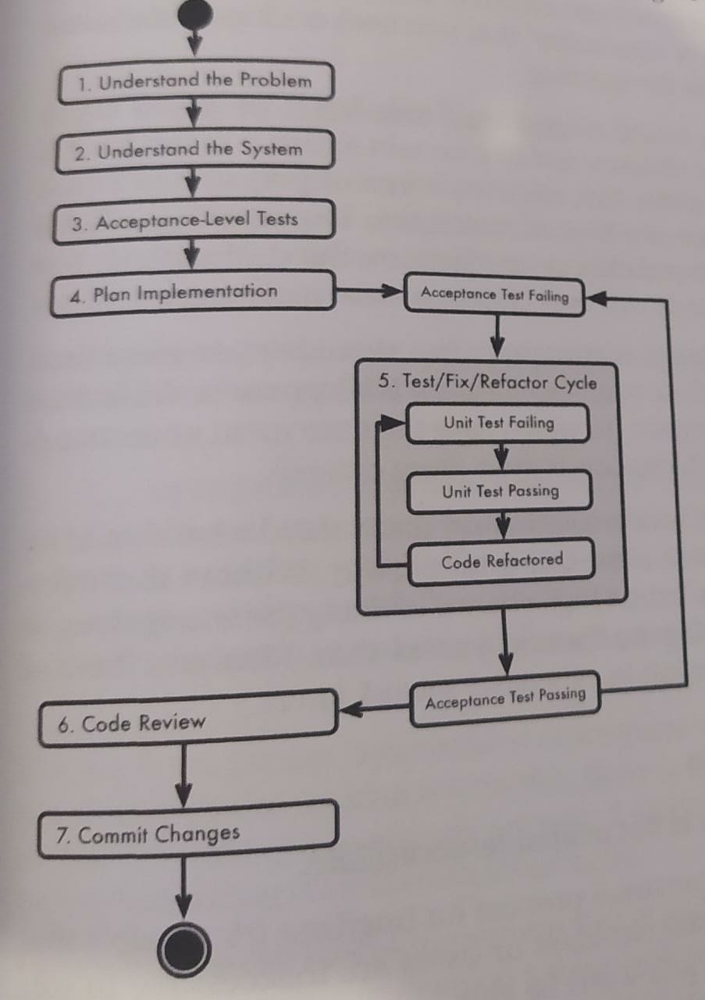

This is a summary of the The Senior Software Engineer, by David Bryant Copeland. I use it while learning and as quick reference. It is not intended to be an standalone substitution of the book so if you really want to learn the concepts here presented, buy and read the book and use this repository as a reference and guide.

Contributions: Issues, comments and pull requests are super welcome 😃.

<!-- TOC depthFrom:1 depthTo:6 withLinks:1 updateOnSave:1 orderedList:0 -->
# Table of Contents
- [Table of Contents](#table-of-contents)
- [Chapter 1. Welcome to Your New Career](#chapter-1-welcome-to-your-new-career)
- [Chapter 2. Focus on Delivering Results](#chapter-2-focus-on-delivering-results)
    - [2.1.-Results](#21-results)
	- [2.2.-Focus](#22-focus)
	- [2.3.-Deliver Smaller Reults More Often](#23-deliver-smaller-results-more-often)
	- [2.4.-Results](#24-plans-schedules-and-status-reports)
	- [2.5.-Results](#25-moving-on)
- [Chapter 3. Fix Bugs Efficiently and Cleanly](#chapter-3-fix-bugs-efficiently-and-cleanly)
    - [3.1.-Overview](#31-overview)
    - [3.2.-Understand the Problem](#32-understand-the-problem)
    - [3.3.-Write Tests that Fail](#33-write-tests-that-fail)
    - [3.4.-Solve the Problem as Quickly as You Can](#34-solve-the-problem-as-quickly-as-you-can)
    - [3.5.-Modify Your Code for Maintainability and Readability](#35-modify-your-code-for-maintainability-and-readability)
    - [3.6.-Commit Your Changes](#36-commit-your-changes)
    - [3.7.-Example](#37-example)
    - [3.8.-Is This Much Process Really Necessary?](#38-is-this-much-process-really-necessary)
    - [3.9.-Moving On](#39-moving-on)
- [Chapter 4. Add Features with Ease](#chapter-4-add-features-with-ease)
    - [4.1.-Understand the Problem](#41-understand-the-problem)
    - [4.2.-Understand the System](#42-understand-the-system)
    - [4.3.-Create Acceptance Level Tests](#43-create-acceptance-level-tests)
    - [4.4.-Plan your Implementation](#44-plan-your-implementation)
    - [4.5.-Repeat the Test/Fix/Refactor Cycle](#45-repeat-the-testfixrefactor-cycle)
    - [4.6.-Get a Code Review](#46-get-a-code-review)
    - [4.7.-Commit Your Changes](#47-commit-your-changes)
    - [4.8.-How to Report Progress](#48-how-to-report-progress)
    - [4.9.-Moving On](#49-moving-on)
- [Chapter 5. Deal With Technical Debt and Slop](#chapter-5-deal-with-technical-debt-and-slop)
    - [5.1.-Slop: Code to Fix Now](#51-slop-code-to-fix-now)
    - [5.2.-Technical Debt: Code to Fix Later (or Never)](#52-technical-debt-code-to-fix-later-or-never)
    - [5.3.-Moving On](#53-moving-on)
- [Chapter 6. Play Well With Others](#chapter-6-play-well-with-others)
    - [6.1.-Empathize With Your Audience](#61-empathize-with-your-audience)
    - [6.2.-Adapt and Abstract Information](#62-adapt-and-abstract-information)
    - [6.3.-Example](#63-example)
    - [6.4.-Moving On](#64-moving-on)
- [Chapter 7. Make Technical Decisions](#chapter-7-make-technical-decisions)
    - [7.1-Identify Facts](#71-identify-facts)
    - [7.2-Identify Priorities](#72-identify-priorities)
    - [7.3-Draw Conclusions](#73-draw-conclusions)
    - [7.4-Example](#74-example)
    - [7.5-Fallacies](#75-fallacies)
    - [7.6-Document the Decision-Making Process](#76-document-the-decision-making-process)
    - [7.7-Moving On](#77-moving-on)
- [Chapter 8. Bootstrap a Greenfield System](#chapter-8-bootstrap-a-greenfield-system)
    - [8.1-Overview](#81-overview)
    - [8.2-Understand the Problem](#82-understand-the-problem)
    - [8.3-Understand the System's Place in the Technical Architecture](#83-understand-the-systems-place-in-the-technical-architecture)
    - [8.4-Choose Technology](#84-choose-technology)
    - [8.5-Outline the Application's Architecture](#85-outline-the-applications-architecture)
    - [8.6-Create a Deployment Checklist](#86-create-a-deployment-checklist)
    - [8.7-Create a Minimum Deployable System](#87-create-a-minimum-deployable-system)
    - [8.8-Add and Deploy Features](#88-add-and-deploy-features)
    - [8.9-Moving On](#89-moving-on)
- [Chapter 9. Learn to Write](#chapter-9-learn-to-write)
    - [9.1-Three Steps to Better Writing](#91-three-steps-to-better-writing)
    - [9.2-Write an Email](#92-write-an-email)
    - [9.3-Write System/Application Documentation](#93-write-systemapplication-documentation)
    - [9.4-Write API Documentation](#94-write-api-documentation)
    - [9.5-Practice Writing](#95-practice-writing)
    - [9.6-Moving On](#96-moving-on)
- [Chapter 10. Interview Potential Co-Workers](#chapter-10-interview-potential-co-workers)
    - [10.1-Ideal Technical Interview](#101-ideal-technical-interview)
    - [10.2-Other Types of Interviews](#102-other-types-of-interviews)
    - [10.3-Moving On](#103-moving-on)
- [Chapter 11. Be Responsive and Productive](#chapter-11-be-responsive-and-productive)
    - [11.1-Being Responsive to Others](#111-being-responsive-to-others)
    - [11.2-Pro-actively Schedule Interruptions](#112-pro-actively-schedule-interruptions)
    - [11.3-A Personal SLA for Communication](#113-a-personal-sla-for-communication)
    - [11.4-Moving On](#114-moving-on)
- [Chapter 12. Lead a Team](#chapter-12-lead-a-team)
    - [12.1-Start the Project](#121-start-the-project)
    - [12.2-Deliver the Project](#122-deliver-the-project)
    - [12.3-Enhance the Project and Fix Bugs](#123-enhance-the-project-and-fix-bugs)
    - [12.4-Leave the Project](#124-leave-the-project)
    - [12.5-Move On](#125-move-on)
- [Chapter 13. Conclusion](#chapter-13-conclusion)
    - [A-Engineer as Product Manager](#a-engineer-as-product-manager)
        - [A.1-Knowing What to Build](#a1-knowing-what-to-build)
        - [A.2-Enter the Product Manager](#a2-enter-the-product-manager)
        - [A.3-Be a Partner](#a3-be-a-partner)
        - [A.4-Doing Your Best Work](#a4-doing-your-best-work)
        - [A.5-Find Out Your Team's Purpose](#a5-find-out-your-teams-purpose)
    - [B-Production is All That Matters](#b-production-is-all-that-matters)
        - [B.1-"DevOps"](#b1-devops)
        - [B.2-Handling Production Errors Matters](#b2-handling-production-errors-matters)
        - [B.3-Detecting Production Errors](#b3-detecting-production-errors)
        - [B.4-Fixing Production Errors](#b4-fixing-production-errors)
        - [B.5-Avoiding Production Errors](#b5-avoiding-production-errors)
        - [B.6-But it's not my job!](#b6-but-its-not-my-job)
    - [C-Responsible Refactoring](#c-responsible-refactoring)
        - [C.1-Be Careful Changing Proven Code](#c1-be-careful-changing-proven-code)
        - [C.2-You Can't Predict the Future](#c2-you-cant-predict-the-future)
        - [C.3-Clean Code is Not an End](#c3-clean-code-is-not-an-end)
        - [C.4-Clean When You Need to Change](#c4-clean-when-you-need-to-change)
        - [C.5-Knowing When a Refactoring Will Help](#c5-knowing-when-a-refactoring-will-help)
    - [D-The World's Shortest Language Primers](#d-the-worlds-shortest-language-primers)
        - [D.1-Ruby](#d1-ruby)
        - [D.2-Java](#d2-java)
    - [E-Reading List](#e-reading-list)
<!-- /TOC -->

# Chapter 1. Welcome to Your New Career

# Chapter 2. Focus on Delivering Results
## 2.1.-Results
- Tools and techniques such as project plans, estimates, and delivery schedules are useful, but different from working software
- Result is an artifact of direct business value:
  - Working code
  - Documentation
  - Definitive statements
## 2.2.-Focus
- Is the act of concentrating interest or activity on something.
- Certain coding tasks would be impossible if you were unable to focus
- Focusing on results: apply this focus to every aspect of your job
## 2.3.-Deliver Smaller Results More Often
- It’s hard to estimate large projects
- Avoid making promises
- By not reporting progress between deliveries, your project will lack visibility.
- Re-imagine your project as a series of small results-driven deliverables.
  - it turns a boring progress report into working, usable software
  - promises of smaller value over shorter time are easier to keep
## 2.4.-Plans, Schedules, and Status Reports
Think of yourself, your team, and your company as an onion:
- You’re at the center and each layer represents the larger structure of which you are a part.
- Inside each layer planning, tracking, processes and other tools for delivery should be used
- But each layer delivers only results to the layer around it

## 2.5.-Moving On

# Chapter 3. Fix Bugs Efficiently and Cleanly
## 3.1.-Overview
## 3.2.-Understand the Problem
- Don’t rush into coding before searching the problem’s context
- Use the buggy software and see the problem yourself
- Talk briefly with a project stakeholder about how the feature should work

Roadblocks:
- Misunderstanding the problem
- No access to the production system or stakeholders
- An actual emergency or business priority
- Pressure to immediately start coding
## 3.3.-Write Tests that Fail
- It’ll be your to-do list
- You’ll code with more confidence

Roadblocks:
- There is no existing test suite
- No infrastructure for tests at the ‘level’ you need to test
## 3.4.-Solve the Problem as Quickly as You Can
- Make sure that the problem you are solving can be solved
- Make your tests green
- Don’t report progress when finishing this step
## 3.5.-Modify Your Code for Maintainability and Readability
- Refactor your code
- Don’t over-engineer and know when to quit

100% sloppy -  Clean code - 100% elegant
## 3.6.-Commit Your Changes
- Take a special care to write a good message
- The first line of your commit message should estate, as briefly and specifically as possible, what the change is.
## 3.7.-Example
## 3.8.-Is This Much Process Really Necessary?
## 3.9.-Moving On

# Chapter 4. Add Features with Ease
#### Basic Workflow for Implementing a Feature

## 4.1.-Understand the Problem
- Identical to that in the previous slides, but it’s more important here
- Before you meet, become intimately familiar with the documentation you’ve been given
## 4.2.-Understand the System
- Answering these questions will help:
- What domain objects will this feature need to interact with?
- What business rules exist around those objects?
- What structures are in place to manage those objects?
- What new objects will you need to create?
- What is the test coverage like? Will you need to add test coverage anywhere before making changes?
## 4.3.-Create Acceptance Level Tests
- It simulates a user using the feature as closely as possible
## 4.4.-Plan your Implementation
- You don’t need to generate some detailed publishable documentation
- The point is to think a bit about how you’re going to get this task done and create a mental roadmap of how it’ll work
- If you cannot explain to another developer how you’re going to solve this problem, you are ill-equipped to start coding
- The best approach is to actually discuss the plan you made with another developer

## 4.5.-Repeat the Test/Fix/Refactor Cycle
- Work in small steps
- Work clean
## 4.6.-Get a Code Review
- Preparing the Review
  - summarize what the feature is and what it solves in just a few short sentences
- Responding to Feedback
- Incorporating Feedback
## 4.7.-Commit Your Changes
- Organize your commit messages
## 4.8.-How to Report Progress

- 1-4: ‘understanding the problem’
- 5: ‘coding‘ or ‘in progress‘
- 6,7: ’in review’

Report at a regular status meeting if your team does them, with what you’ve done or what you plan to work on next, but with no indication of any level of completeness.

## 4.9.-Moving On

# Chapter 5. Deal With Technical Debt and Slop
## 5.1.-Slop: Code to Fix Now
- It is code:
  - poorly written
  - counter-intuitive
  - with duplication
  - with poor test coverage
  - missing error handling
  - with inconsistent use of logging
  - with lack of validation of assumptions
- Quickly fixable
## 5.2.-Technical Debt: Code to Fix Later (or Never)
- Technical dept is code written under certain assumptions that no longer hold
- It’s a code that makes a tradeoff
- It’s a way to deliver results when they’re needed

## 5.3.-Moving On

# Chapter 6. Play Well With Others
## 6.1.-Empathize With Your Audience
## 6.2.-Adapt and Abstract Information
- Adapt Terms
- Abstract Concepts to Simplify Them
## 6.3.-Example
## 6.4.-Moving On

# Chapter 7. Make Technical Decisions
## 7.1-Identify Facts
## 7.2-Identify Priorities
## 7.3-Draw Conclusions
## 7.4-Example
## 7.5-Fallacies
## 7.6-Document the Decision-Making Process
## 7.7-Moving On

# Chapter 8. Bootstrap a Greenfield System
## 8.1-Overview
## 8.2-Understand the problem
## 8.3-Understand the System's Place in the Technical Architecture
## 8.4-Choose Technology
## 8.5-Outline the Application's Architecture
## 8.6-Create a Deployment Checklist
## 8.7-Create a Minimum Deployable System
## 8.8-Add and Deploy Features
## 8.9-Moving On

# Chapter 9. Learn to Write
## 9.1-Three Steps to Better Writing
## 9.2-Write an Email
## 9.3-Write System/Application Documentation
## 9.4-Write API Documentation
## 9.5-Practice Writing
## 9.6-Moving On

# Chapter 10. Interview Potential Co-Workers
## 10.1-Ideal Technical Interview
## 10.2-Other Types of Interviews
## 10.3-Moving On

# Chapter 11. Be Responsive and Productive
## 11.1-Being Responsive to Others
## 11.2-Pro-actively Schedule Interruptions
## 11.3-A Personal SLA for Communication
## 11.4-Moving On

# Chapter 12. Lead a Team
## 12.1-Start the Project
## 12.2-Deliver the Project
## 12.3-Enhance the Project and Fix Bugs
## 12.4-Leave the Project
## 12.5-Move On

# Chapter 13. Conclusion
## A-Engineer as Product Manager
### A.1-Knowing What to Build
### A.2-Enter the Product Manager
### A.3-Be a Partner
### A.4-Doing Your Best Work
### A.5-Find Out Your Team's Purpose

## B-Production is All That Matters
### B.1-"DevOps"
### B.2-Handling Production Errors Matters
### B.3-Detecting Production Errors
### B.4-Fixing Production Errors
### B.5-Avoiding Production Errors
### B.6-But it's not my job!

## C-Responsible Refactoring
### C.1-Be Careful Changing Proven Code
### C.2-You Can't Predict the Future
### C.3-Clean Code is Not an End
### C.4-Clean When You Need to Change
### C.5-Knowing When a Refactoring Will Help

## D-The World's Shortest Language Primers
### D.1-Ruby
### D.2-Java

## E-Reading List